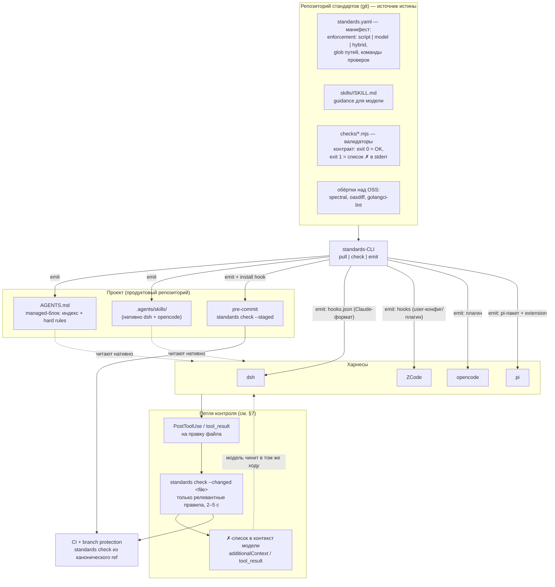
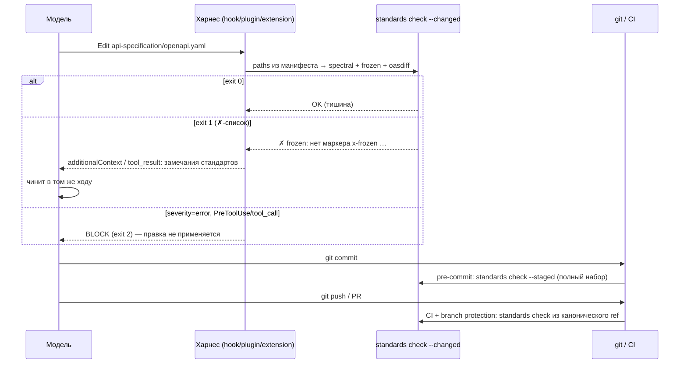

# concept.md — standards-CLI: доставка и контроль стандартов разработки в LLM-харнесы

> Статус: концепт на обсуждение.
> Дата: 2026-09-21.
> Исходная идея: [idea.md](idea.md). Все технические утверждения о харнесах проверены по исходникам/документации — источники в разделе «Фактическая база».

---

## 1. Постановка задачи

Стандарты разработки (API First, компонентные тесты, TBD, ...) живут в Git-репозитории. Нужно, чтобы LLM-харнесы, в которых работает команда, делали две вещи:

1. **Поддержка** — получали правила разработки в свой контекст (AGENTS.md, skills), чтобы код писался по стандарту, а не исправлялся потом.
2. **Контроль** — проверяли соблюдение стандартов **во время** разработки и возвращали модели конкретные замечания в моменте, а не красным CI через полчаса. Всё, что можно проверить детерминированно, проверяется скриптами **до CI** — локально, в петле разработки.

Целевые харнесы: **deepseek-harness (dsh)**, **pi**, **opencode**, **ZCode (Z.ai ADE)**.

Ключевой принцип проектирования: **разделение «что проверяется скриптами» и «что отдаётся модели» фиксируется в данных** (манифесте репозитория стандартов), а не в договорённостях между людьми.

---

## 2. Принцип: script vs model

Каждый стандарт в каноническом репозитории декларирует способ исполнения:

| `enforcement` | Что это | Примеры из наших стандартов |
|---|---|---|
| `script` | Детерминированная проверка командой с кодом возврата. Не зависит от настроения модели. | OpenAPI-спека: `spectral lint`, `oasdiff breaking`, маркер `x-frozen:`; счётчик сценариев компонентных тестов `N = 1 + Σ`; заголовки тикетов; формат коммитов |
| `model` | Guidance: markdown-скилл с описанием «где и как». Проверяется только пониманием модели и ревью. | «Как элицитировать требования», «как писать стабы вместо моков», стиль документации |
| `hybrid` | Структуру и счётчики проверяет скрипт; смысловую часть делает модель по скиллу. | Компонентные тесты: где живут и как писать — скилл; сколько сценариев, все ли `@wip`, есть ли smoke — валидатор |

Это разделение **уже существует де-факто** в [rationaldev-ai-sdlc-skills](https://github.com/codemonstersteam/rationaldev-ai-sdlc-skills): 32 скилла-стандарта (`skills/lib/<name>/SKILL.md`) + 17 детерминированных валидаторов (`harness/validate-*.mjs`), у ~12 из 32 скиллов есть скрипт-проверки. Концепт формализует это разделение манифестом и достраивает недостающее: доставку в 4 харнеса и петлю контроля.

Сквозной пример (из обсуждения):

- **«Формат и правила описания API-спецификаций»** → писать по стандарту (скилл `openapi-spec`), валидировать скриптами, которые уже написаны в open source или дополнены: `spectral` (линт правил из ruleset — в pinout-openapi этого уровня сейчас нет), `oasdiff breaking` (уже используется в `validate-contract-diff.mjs`), свой валидатор `x-frozen`.
- **«Где и как писать компонентные тесты»** → скилл `component-tests` (расположение `component-tests/features/*.feature`, Docker Compose, стабы по реальному протоколу); детерминированно проверяются только структура и счёт: число сценариев = формула из дизайна, все бизнес-сценарии `@wip`, есть smoke (`validate-component-tests.mjs`).

---

## 3. Архитектура



Три контура:

1. **Поддержка** — AGENTS.md + skills в контексте модели (до того, как код написан).
2. **Контроль в моменте** — hooks/extension на правки → быстрая проверка → замечание модели (пока код пишется).
3. **Контроль до/в CI** — pre-commit на коммит, CI с branch protection как единственный непроходимый рубеж (после того, как код написан).

---

## 4. Канонический репозиторий стандартов

Структура (совместима с существующим rationaldev-ai-sdlc-skills — он становится первым источником, а не единственным):

```
standards-repo/
├── standards.yaml            # манифест — разделение script/model в данных
├── skills/
│   └── <name>/SKILL.md       # guidance: frontmatter name/description/version/status + текст
└── checks/
    ├── validate-frozen.mjs   # свои валидаторы: zero-dep Node, exit 0/1
    ├── spectral.yaml         # ruleset для OpenAPI (OSS)
    └── oasdiff.sh            # обёртка breaking-проверки контракта (OSS)
```

### 4.1. Манифест `standards.yaml`

```yaml
version: 1
source: https://github.com/codemonstersteam/rationaldev-ai-sdlc-skills

standards:
  - id: openapi-spec
    enforcement: hybrid
    guidance: skills/openapi-spec/SKILL.md
    checks:
      - cmd: "npx @stoplight/spectral-cli lint api-specification/openapi.yaml --ruleset $STANDARDS_HOME/checks/spectral.yaml"
        paths: ["api-specification/openapi.*"]
        severity: error          # error = блокирует, warn = только замечание
      - cmd: "node $STANDARDS_HOME/checks/validate-frozen.mjs api-specification/"
        paths: ["api-specification/**"]
        severity: error
      - cmd: "node $STANDARDS_HOME/checks/oasdiff.sh"
        paths: ["api-specification/openapi.*"]
        severity: error          # breaking замороженного контракта

  - id: component-tests
    enforcement: hybrid
    guidance: skills/component-tests/SKILL.md
    checks:
      - cmd: "node $STANDARDS_HOME/checks/validate-component-tests.mjs ."
        paths: ["component-tests/**", "docs/design/**"]
        severity: error

  - id: requirements-intake
    enforcement: model          # только guidance, скрипт-проверок нет
    guidance: skills/requirements-intake/SKILL.md
```

Назначение полей:

- `paths` — маппинг «какие файлы затронуты → какие проверки запускать». Это основа быстрой петли: на правку одного файла запускается 1–3 проверки, а не весь набор.
- `severity: error | warn` — `error` даёт блок (см. §6), `warn` только возвращает замечание.
- `$STANDARDS_HOME` — путь к кэш-клону репозитория стандартов; проверки всегда исполняются из кэша, контролируемого `git`, а не из копий в продукте.

### 4.2. Контракт валидаторов

Переиспользуем контракт, уже доказанный в rationaldev (`harness/validate-*.mjs`, 17 скриптов):

- `exit 0` — ОК, в stdout одна строка `OK — <что проверено>`;
- `exit 1` — нарушения: в stderr список строк `✗ <правило>: <файл>: <что не так>`;
- `exit 2` — fail-closed: окружение сломано (нет инструмента в PATH) — это не «молчаливый успех» (так делает `validate-contract-diff.mjs`: отсутствие `oasdiff` в PATH = STOP с командой установки).

Машиночитаемый формат для hooks (опция `--format json`): `{violations: [{rule, file, line, message, fix_hint}]}` — `fix_hint` из манифеста/валидатора попадает прямо в контекст модели.

---

## 5. CLI `standards`

Три команды. Оценка объёма: ~500–800 строк TypeScript/Node, ноль зависимостей рантайма (кроме `git` и вызываемых проверок).

### 5.1. `standards pull [--ref <git-ref>]`

- Клонирует/обновляет репозиторий стандартов в кэш: `~/.cache/dev-standards/<repo-hash>/` (git clone/pull).
- Записывает lock-файл в проект: `.standards-lock.json` — `{source, ref, commit}` — коммитится в продуктовый репозиторий. CI сверяет lock с ожидаемым ref (см. §7).
- После pull — подсказка пере-генерировать проекции (`emit`).

### 5.2. `standards check [--staged | --changed <file>...] [--format text|json]`

Единая точка входа для **всех** скрипт-проверок:

- без флагов — полный набор по манифесту;
- `--staged` — только проверки, чьи `paths` пересекаются с `git diff --cached`;
- `--changed <file>` — проверки для конкретных файлов (это то, что дёргают hooks);
- агрегирует результаты: единый `✗`-список, суммарный exit code. Любая `error`-проверка с exit ≠ 0 → общий exit 1.

### 5.3. `standards emit <dsh|opencode|zcode|pi|all> --into .`

Материализует проекции под каждый харнес (idempotent — повторный запуск обновляет, не дублируя):

| Артефакт | Куда | Кто читает |
|---|---|---|
| managed-блок в `AGENTS.md` | корень проекта | все 4 харнеса (см. §6 таблицу) |
| skills | `.agents/skills/<name>/SKILL.md` (копия или симлинк на кэш) | dsh (корень проекта, ранг 200), opencode |
| skills (копия) | `~/.zcode/skills/<name>/SKILL.md` | ZCode (только user-уровень) |
| `hooks.json` (Claude-формат) | `.claude/settings.json`-совместимое расположение | dsh — через встроенный мост `hooks-claude-code` |
| hooks (те же события) | `~/.zcode/cli/config.json` (user) или плагин | ZCode — проектные hooks игнорируются, поэтому только так |
| плагин | `.opencode/plugins/standards-guard.*` + запись в `opencode.json` | opencode |
| pi-пакет | пакет с extension + `"pi"`-манифестом; `pi install git:...` или локальный путь | pi |

Managed-блок в AGENTS.md ограничен маркерами и содержит только индекс стандартов + hard rules (лимит dsh — 64 КБ на всю цепочку инструкций, поэтому детали живут в skills):

```markdown
<!-- dev-standards:start v1.2.0 (source: ...@abc1234) -->
## Стандарты разработки (генерируется, не редактировать вручную)

### Hard rules (проверяются скриптами, ошибки блокируют)
- Контракт первичен: поведение меняется сначала в `api-specification/openapi.yaml`
  (маркер `x-frozen:`), затем в коде. Breaking-изменения замороженного
  контракта запрещены (`oasdiff breaking`).
- Компонентные тесты: `component-tests/features/*.feature`, число сценариев
  `N = 1 + Σ(ветки адаптеров)` из дизайна, все бизнес-сценарии `@wip`, ≥1 smoke.

### Навыки (подробности — вызывай по необходимости)
- `openapi-spec` — авторинг OpenAPI/AsyncAPI контракта сервиса
- `component-tests` — где и как писать компонентные тесты
- ... (полный индекс — по описаниям skills)
<!-- dev-standards:end -->
```

---

## 6. Проекции: что подтверждено по каждому харнесу

Все утверждения — из исходников (локально) или официальных доков; источники в §10.

| | dsh (deepseek-harness) | pi | opencode | ZCode (Z.ai ADE) |
|---|---|---|---|---|
| Читает `AGENTS.md` | ✅ глобальный `~/.dsh/AGENTS.md` + цепочка от корня проекта до cwd | ✅ `~/.pi/agent/AGENTS.md` + все родительские директории от cwd | ✅ + массив `instructions` (глобы и URL) в `opencode.json` | ✅ ровно 2 файла: `~/.zcode/AGENTS.md` + корневой `AGENTS.md`, конкатенация |
| Skills | ✅ `.dsh/skills` (ранг 100), `.agents/skills` (ранг 200), `customSkillDirs`, `~/.agents/skills` | ✅ из пакетов (`"pi": {"skills": [...]}`) | ✅ `.opencode/skills/`, `.agents/skills/`, `~/.agents/skills/` | ✅ `~/.zcode/skills/<name>/SKILL.md` (user-уровень), плагины |
| Поверхность контроля «в моменте» | ✅ пакет `hooks-claude-code`: читает Claude-Code `hooks.json`; `PreToolUse` может **блокировать**, `PostToolUse` — добавлять контекст модели | ✅ extension-события: `tool_call` (можно блокировать), `tool_result` (можно модифицировать), `before_agent_start` (инъекция контекста) | ✅ плагины: `tool.execute.before` / `tool.execute.after` | ✅ hooks `SessionStart`/`UserPromptSubmit`/`PreToolUse`/`PostToolUse` + `hookSpecificOutput.additionalContext`; **но только из user-конфига или плагина — проектные hooks игнорируются** |
| Нативная тяга из git | ❌ (npm-бандлы `dsh plugin add`) | ✅ `pi install git:github.com/org/repo@v1` | частично: `instructions` принимает URL файлов (таймаут 5 с) | ✅ плагины из marketplace с source `git`/`github` |
| MCP | ✅ (только tools) | ❌ нет встроенного MCP | ✅ | ✅ |

Особенности, учтённые в дизайне:

- **dsh**: лимит `maxBytes` 65536 на цепочку instruction-файлов → в AGENTS.md только индекс; skills горячо перегружаются (watcher) — правки стандартов подхватываются без рестарта.
- **pi**: нет MCP и нет hooks-конфига — единственный путь контроля это extension (фаза 2); зато установка из git нативна и проверена (`pi-grok` в `~/.pi/agent/settings.json` стоит именно так).
- **opencode**: в rationaldev уже есть работающий аналог плагина (`rational-guardrail.mjs` на `tool.execute.before/after`) — берём как референс.
- **ZCode**: AGENTS.md не поддерживает include → только managed-блок с полным (но коротким) содержимым; hooks — только через `~/.zcode/cli/config.json` (инсталлятор пишет в user-конфиг с idempotent-merge) или собственный плагин (фаза 2, плагин сам обновляется из git-источника).

---

## 7. Петля контроля «в моменте» и проверки до CI



Правила поведения петли:

1. **Замечание, не приговор (по умолчанию).** Обычные нарушения возвращаются в контекст модели текстом с `fix_hint` — модель правит сама, цикл занимает секунды.
2. **Блок — только для критичных правил.** `severity: error` + `PreToolUse`/`tool_call` (exit 2 / block): например, попытка изменить замороженный контракт или закоммитить в trunk. Блокирующих правил должно быть мало — иначе петля превращается в раздражитель и его отключат (см. §8).
3. **До CI:** `standards check --staged` вешается в pre-commit (обвязка — `standards emit` кладёт готовый хук). Полный набор — секунды-десятки секунд, потому что свои валидаторы zero-dep, а OSS-инструменты запускаются только для затронутых путей.
4. **CI — последняя линия:** тот же `standards check`, но проверка и правила берутся из канонического ref репозитория стандартов (не из локального кэша и не из копий в проекте), результат — required status check в branch protection. Рецепты берём готовые: в rationaldev есть `ci/recipes/{github-actions,gitlab-ci}[-contract-diff].yml`.
5. **Lock-файл** `.standards-lock.json` коммитится в проект. CI сверяет: коммит стандартов из lock должен существовать в каноническом репо (нельзя «сидеть на удалённой ветке»), а политика может требовать свежести (например, не старше N дней / не дальше M коммитов от main). Так обход «работаю по старым правилам» становится видимым в PR.

---

## 8. Уровни принуждения и модель угроз

Принятая рамка: **всё клиентское — это скорость петли, а не запрет.** Единственный непроходимый рубеж — серверный (CI + branch protection). Обходы перечислены честно, по слоям:

| Слой | Вектор обхода | Роль слоя / реакция |
|---|---|---|
| AGENTS.md + skills (поддержка) | Модель игнорирует инструкции; разработчик редактирует managed-блок | Advisory по определению. Правки managed-блока видны в PR (блок в продуктовом репо) |
| Hooks/plugin/extension в харнесе | Конфиги лежат на машине разработчика: dsh — плагин убирается из профиля (`$DSH_HOME/profiles/...`); ZCode — запись в `~/.zcode/cli/config.json` удаляется / `"hooks": {"enabled": false}`; opencode — плагин отключается глобальным конфигом или `OPENCODE_CONFIG`; pi — пакет не установлен/удалён | Ожидаемо. Слой существует, чтобы модель получала замечания за секунды. Его отключение = возврат к статусу-кво «ловит CI» |
| Pre-commit | `git commit --no-verify`, прямой `git push`, удаление `.git/hooks/*` | Классика; это фильтр удобства, не барьер |
| Сам CLI | Подмена `standards` в PATH заглушкой с exit 0; правка локального кэша стандартов | Кэш — не источник истины: CI гоняет проверки из канонического ref. Lock-файл фиксирует, что реально использовалось |
| Вне харнеса | Правка кода в IDE без агента — hooks харнеса не срабатывают | Покрывается только CI. Это нормально: стандарт применяется к результату (диффу), а не к инструменту |
| CI + branch protection | Только админские/серверные механизмы (форс-пуш, изменение правил бранча) | Единственный непроходимый рубеж. Политика уровня организации (protected branches, required checks, rulesets) — вне скоупа этого инструмента, но предполагается |

Контрмеры **видимости** (вместо невозможного «запрета»):

- lock-файл версии стандартов в PR (см. §7 п.5);
- блокирующий режим только для узкого списка критичных правил — чтобы не было мотива всё отключить;
- `standards check` в CI печатает источник и коммит стандартов в отчёт.

Пытаться сделать клиентские слои «непроходимыми» — значит воевать с владельцем машины; это проигрышная архитектурная позиция, и мы её не занимаем.

---

## 9. Ограничения и фазы

### 9.1. Известные ограничения

- **dsh**: 64 КБ на цепочку инструкций (`maxBytes`, база 65536) — managed-блок держим коротким, детали в skills.
- **ZCode**: AGENTS.md без include/imports — только развёрнутый managed-блок; hooks не работают из проекта — пишем в user-конфиг (idempotent-merge) или плагином; skills только на user-уровне — копии обновляются re-emit'ом, не `git pull`.
- **pi**: нет MCP, нет hooks-конфига — контроль только через extension (фаза 2).
- **Сеть**: `pull` требует доступа к git; офлайн — работа со старым кэшем (это фиксируется lock-файлом и видно в CI).

### 9.2. Фазы

| Фаза | Состав | Результат |
|---|---|---|
| **1. MVP** | `standards pull` + `check` + `emit` для AGENTS.md / skills / hooks (dsh, opencode, ZCode); pre-commit-обвязка; первый источник — rationaldev-ai-sdlc-skills + spectral-ruleset | Петля «в моменте» на 3 харнесах из 4; проверки до CI |
| **2. pi + автообновление** | pi-пакет (extension на `tool_call`/`tool_result`) с нативной установкой `pi install git:...`; ZCode-плагин как marketplace git-source (скиллы+hooks+автообновление одной упаковкой) | Все 4 харнеса; меньше ручных re-emit |
| **3. CI-контур** | CI-рецепты (переиспользовать `ci/recipes` из rationaldev), lock-политика свежести, отчёт версии стандартов, машиночитаемый `--format json` для дашбордов | Непроходимый рубеж + видимость того, по каким правилам работал PR |

### 9.3. Отклонённые альтернативы

- **A. Расширить инсталлер rationaldev на 3 новых харнеса** (симлинки как у claude/opencode/codex). Минус: решение привязано к структуре одного репозитория стандартов; у ZCode симлинки на user-уровне не обновляются git pull'ом; нет единой точки входа для проверок. Полезные механики A (контракт валидаторов, Claude-формат hooks, диспетчеризация в OSS) переиспользуются внутри B.
- **C. MCP-сервер проверок** (`standards_rules`/`standards_check` тулами). Минусы: pi без MCP — нужен extension всё равно; замечание попадает к модели только если она сама вызвала тул — нет принуждения «в моменте»; dsh-мост прокидывает только tools (ни resources, ни prompts).

---

## 10. Фактическая база (источники)

Локально проверено по исходникам:

- **deepseek-harness** (`~/IdeaProjects/codemonstersdev/deepseek-harness`): `packages/context/agent-instructions` (цепочка AGENTS.md/CLAUDE.md, `maxBytes` 65536 в `packages/bundle/base/cordis.patch.yml`), `packages/hooks/hooks-claude-code` (Claude-Code hooks.json, блокировка + контекст), `packages/skill/skill-filesystem` (ранги skills-рутов: `.dsh/skills`=100, `.agents/skills`=200, `customSkillDirs`=300, `~/.agents/skills`=500, hot-reload), `packages/mcp/mcp-client` (только tools).
- **pi** (`pi-extensible-workflows/node_modules/@earendil-works/pi-coding-agent`): `dist/core/resource-loader.js` (AGENTS.md/CLAUDE.md, глобальный + обход родителей), `docs/extensions.md` (события `tool_call` — блок, `tool_result` — модификация, `before_agent_start` — инъекция; строки 303–307), `docs/packages.md` (`pi install git:github.com/user/repo@v1`, манифест `"pi": {extensions, skills, prompts}`); живой пример git-пакета — `git:github.com/stnly/pi-grok@v0.10.1` в `~/.pi/agent/settings.json`; отсутствие MCP — `docs/usage.md`.
- **rationaldev-ai-sdlc-skills**: `skills/lib/` (32 SKILL.md), `harness/validate-*.mjs` (17 валидаторов, контракт exit 0/1, `validate-contract-diff.mjs` — exit 2 fail-closed + диспетчеризация в `oasdiff breaking`/`asyncapi diff`), `harness/enforcement/` (Claude hooks с exit 2 = block; opencode-плагин `rational-guardrail.mjs`), `ci/recipes/`, `install.sh` (паттерн симлинк-проекций).
- **pinout-openapi**: материализация стандартов симлинками (`.gitignore` исключает артефакты харнеса), запуск валидаторов агентом вручную по ходу цикла (allow-list в `.claude/settings.local.json`), CI только `go build/vet/test` + компонент-тесты (`component-tests/scripts/run-tests.sh`, отдельный Go-модуль godog) — уровней spectral/golangci-lint и pre-commit нет; gaps зафиксированы в `pinout-workspace/TASK.md`.

Официальная документация (проверено 2026-09):

- opencode: [opencode.ai/docs/rules](https://opencode.ai/docs/rules/) (`instructions` с глобами и URL, таймаут 5 с), [/docs/config](https://opencode.ai/docs/config/), [/docs/plugins](https://opencode.ai/docs/plugins/) (`tool.execute.before/after`), [/docs/skills](https://opencode.ai/docs/skills/) (в т.ч. `.agents/skills/`).
- ZCode (Z.ai ADE): [zcode.z.ai/en/docs/agents](https://zcode.z.ai/en/docs/agents) (ровно 2 AGENTS.md, без include), [/en/docs/hooks](https://zcode.z.ai/en/docs/hooks) (события, `additionalContext`, игнор проектных hooks — `config_project_hooks_ignored`), [/cn/docs/skill](https://zcode.z.ai/cn/docs/skill) (`~/.zcode/skills/`), [/cn/docs/plugin](https://zcode.z.ai/cn/docs/plugin) (marketplace source `git`/`github`), [/cn/docs/mcp-services](https://zcode.z.ai/cn/docs/mcp-services).
- Конвенция AGENTS.md: [agents.md](https://agents.md/) (фонд Agentic AI Foundation под эгидой Linux Foundation; все 4 наших харнеса читают AGENTS.md, что подтверждено их собственными доками/кодом выше).
