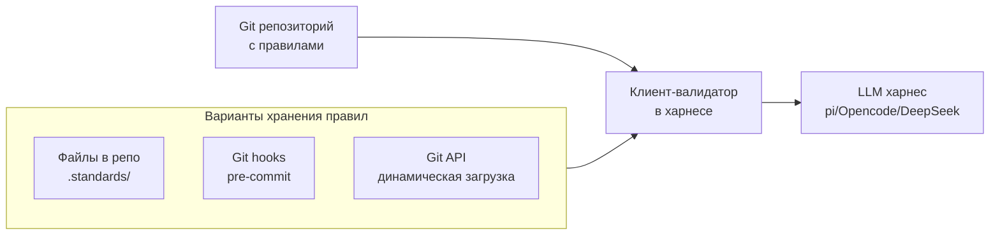
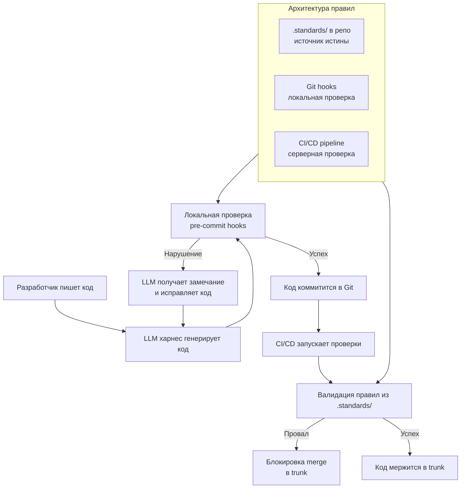

Отличная идея! Хранение правил в Git — это естественная эволюция, которая упрощает внедрение, делает правила версионированными и доступными через стандартные инструменты. Вот как это можно реализовать.



## 📁 Вариант 1: Файлы правил прямо в репозитории

Храните правила в отдельной директории (например, `.standards/`) или в файлах `STANDARDS.md`, `CODE_OF_CONDUCT.md`.

**Структура репозитория:**
```
my-project/
├── .standards/
│   ├── api-first.yaml      # Правила для API First
│   ├── tbd.yaml           # Правила для Trunk Based Development
│   ├── component-tests.yaml # Правила для компонентных тестов
│   └── global.yaml        # Общие правила
├── src/                    # Исходный код
└── tests/                  # Тесты
```

**Пример файла `.standards/api-first.yaml`:**
```yaml
# Стандарт: API First
version: 1.0
last_updated: 2026-09-18
owner: api-team@example.com

rules:
  - id: api_first_spec_required
    description: "Каждый новый endpoint должен иметь OpenAPI-спецификацию"
    severity: error
    check:
      type: file_exists
      pattern: "openapi.yaml"
      must_contain: "paths:/{path}:"
    message: "Найден новый endpoint {path}, но он отсутствует в OpenAPI-спецификации"
    fix: "Добавьте описание в openapi.yaml: {path}, методы, схемы запросов/ответов"
    
  - id: api_first_contract_test
    description: "Реализация должна проходить контрактные тесты по спеке"
    severity: error
    check:
      type: command
      command: "schemathesis run http://localhost:8000/openapi.json --checks all"
    message: "Контрактные тесты не прошли: {output}"
    fix: "Исправьте реализацию так, чтобы она соответствовала openapi.yaml"
```

**Преимущества:**
- **Версионирование**: Правила хранятся в Git, легко откатить изменения
- **Code review**: Изменения правил проходят через PR, как и код
- **Доступность**: Любой разработчик может увидеть правила без доступа к серверу
- **Простота интеграции**: Харнес просто читает файлы из репо

---

## 🔗 Вариант 2: Git hooks для локальной проверки

Используйте pre-commit hooks для проверки правил до коммита. Это гарантирует, что в Git не попадёт код, нарушающий стандарты.

**Пример `pre-commit` хука:**
```bash
#!/bin/bash
# .git/hooks/pre-commit

STANDARDS_DIR=".standards"
VIOLATIONS=0

# Функция для валидации по правилам из YAML
validate_rule() {
    local rule_file=$1
    local rule_id=$2
    
    # Здесь логика проверки по типу правила
    # Например, для file_exists:
    if [[ $rule_id == "api_first_spec_required" ]]; then
        # Проверяем, есть ли для нового endpoint спека
        if ! grep -q "paths:/new-endpoint" openapi.yaml 2>/dev/null; then
            echo "❌ Нарушение API First: отсутствует спека для /new-endpoint"
            echo "   Fix: Добавьте в openapi.yaml описание /new-endpoint"
            return 1
        fi
    fi
    return 0
}

# Проверяем все правила из .standards/
for rule_file in $STANDARDS_DIR/*.yaml; do
    # Парсим YAML и проверяем каждое правило
    # Это упрощенный пример — в реальности использовать yq или Python
    echo "Проверяем правила из $rule_file..."
    validate_rule "$rule_file" "api_first_spec_required" || VIOLATIONS=$((VIOLATIONS+1))
done

if [ $VIOLATIONS -gt 0 ]; then
    echo "❌ Найдено нарушений стандартов: $VIOLATIONS"
    echo "   Коммит отменён. Исправьте ошибки и попробуйте снова."
    exit 1
fi

echo "✅ Все проверки стандартов пройдены"
exit 0
```

**Преимущества:**
- **Быстрая обратная связь**: Нарушения видны сразу, до коммита
- **Гарантия качества**: Нельзя закоммитить код, нарушающий стандарты
- **Локальность**: Проверка выполняется на машине разработчика

**Ограничения:**
- **Только локальная проверка**: Не проверяет PR в Git
- **Зависимость от окружения**: Нужен установленный `yq` или Python
- **Не проверяет LLM-харнес**: Нужна интеграция с харнесом отдельно

---

## 🌐 Вариант 3: Git API для динамической загрузки правил

Харнес может динамически загружать правила из Git через API (например, GitHub/GitLab API). Это позволяет:
- Обновлять правила без пересборки харнеса
- Использовать разные ветки для разных версий правил
- Интегрировать с CI/CD

**Пример запроса к Git API:**
```python
import requests
import yaml

class GitStandardsLoader:
    def __init__(self, repo_url, branch="main", token=None):
        self.repo_url = repo_url
        self.branch = branch
        self.token = token
    
    def load_standards(self):
        """Загружает все правила из .standards/ репозитория"""
        api_url = f"https://api.github.com/repos/{self.repo_url}/contents/.standards"
        headers = {"Authorization": f"token {self.token}"} if self.token else {}
        
        response = requests.get(api_url, headers=headers)
        if response.status_code != 200:
            raise Exception(f"Failed to load standards: {response.text}")
        
        standards = {}
        for file_info in response.json():
            if file_info["name"].endswith((".yaml", ".yml", ".json")):
                file_url = file_info["download_url"]
                file_response = requests.get(file_url, headers=headers)
                if file_response.status_code == 200:
                    # Парсим YAML/JSON
                    rule_data = yaml.safe_load(file_response.text)
                    standards[file_info["name"]] = rule_data
        
        return standards

# Использование в харнесе
loader = GitStandardsLoader("my-org/my-project")
rules = loader.load_standards()

# Проверка кода по правилам
def validate_code(code, rules):
    violations = []
    for rule_file, rule_data in rules.items():
        for rule in rule_data.get("rules", []):
            # Логика проверки по типу правила
            if rule["check"]["type"] == "file_exists":
                # Проверяем наличие файла
                pass
            elif rule["check"]["type"] == "command":
                # Выполняем команду
                pass
    return violations
```

**Преимущества:**
- **Актуальность**: Всегда использует последние правила из ветки `main`
- **Гибкость**: Можно использовать разные ветки для разных окружений
- **Централизованность**: Правила хранятся в одном месте, но доступны везде

**Недостатки:**
- **Сетевые задержки**: Запрос к API может занять время
- **Зависимость от Git-провайдера**: Нужно реализовать для GitHub/GitLab/Bitbucket
- **Безопасность**: Нужно хранить токен доступа

---

## 🔄 Гибридная модель: Git + CI/CD + LLM

Наиболее практичный подход — комбинация всех методов:



**Как это работает:**
1. **Правила** хранятся в `.standards/` в репозитории (источник истины)
2. **LLM-харнес** при генерации кода проверяет его по правилам из репо (через Git API или прямое чтение файлов)
3. **Pre-commit hooks** проверяют правила локально до коммита
4. **CI/CD** проверяет правила при создании PR, блокируя merge при нарушениях

**Пример интеграции с CI/CD (GitHub Actions):**
```yaml
# .github/workflows/standards-check.yml
name: Standards Check
on: [pull_request, push]

jobs:
  check-standards:
    runs-on: ubuntu-latest
    steps:
      - uses: actions/checkout@v4
      
      - name: Setup Python
        uses: actions/setup-python@v5
        with:
          python-version: '3.11'
          
      - name: Install dependencies
        run: |
          pip install pyyaml schemathesis
          curl -sSf https://raw.githubusercontent.com/schemathesis/schemathesis/master/get-schemathesis.sh | sh
          
      - name: Validate API First rules
        run: |
          # Проверяем наличие openapi.yaml
          if [ ! -f "openapi.yaml" ]; then
            echo "❌ Нарушение API First: отсутствует openapi.yaml"
            exit 1
          fi
          
          # Валидируем спеку Spectral
          npx @stoplight/spectral-cli lint openapi.yaml
          
      - name: Run contract tests
        run: |
          # Запускаем schemathesis против API
          schemathesis run http://localhost:8000/openapi.json --checks all
          
      - name: Check component tests
        run: |
          # Проверяем структуру тестов
          for component in src/*; do
            if [ ! -f "tests/components/$(basename $component)/test_$(basename $component).py" ]; then
              echo "❌ Нарушение стандарта тестов: отсутствуют тесты для $(basename $component)"
              exit 1
            fi
          done
          
          # Проверяем покрытие
          pytest --cov=src --cov-fail-under=80
```

---

## 📊 Сравнение вариантов

| Вариант | Плюсы | Минусы | Сложность | Рекомендуется |
| :--- | :--- | :--- | :--- | :--- |
| **Файлы в репо** | Версионирование, простота, доступность | Требует парсинга YAML в харнесе | Низкая | Для старта |
| **Git hooks** | Быстрая обратная связь, гарантия качества | Только локально, зависит от окружения | Средняя | Для команд |
| **Git API** | Динамическая загрузка, актуальность | Сетевые задержки, зависимость от провайдера | Высокая | Для крупных проектов |
| **Гибрид** | Лучшее из всех миров | Сложность настройки | Высокая | Для enterprise |

---

## 💡 Практические рекомендации

1. **Начните с файлов в репо**: Создайте `.standards/` с YAML-правилами для API First и тестов.
2. **Добавьте pre-commit hooks**: Настройте простые проверки (наличие файлов, базовый линтинг).
3. **Интегрируйте с LLM-харнес**: Добавьте функцию загрузки правил из Git при инициализации харнеса.
4. **Настройте CI/CD**: Добавьте workflow, который проверяет правила при PR.

**Пример минимальной интеграции с харнесом:**
```python
# В харнесе pi/Opencode/DeepSeek
import yaml
from pathlib import Path

class StandardsValidator:
    def __init__(self, repo_path="."):
        self.repo_path = Path(repo_path)
        self.standards = self.load_standards()
    
    def load_standards(self):
        """Загружает правила из .standards/"""
        standards = {}
        standards_dir = self.repo_path / ".standards"
        
        if standards_dir.exists():
            for file_path in standards_dir.glob("*.yaml"):
                with open(file_path, "r") as f:
                    rule_data = yaml.safe_load(f)
                    standards[file_path.stem] = rule_data
        
        return standards
    
    def validate_code(self, code, language):
        """Валидирует код по правилам"""
        violations = []
        
        for approach, rules in self.standards.items():
            for rule in rules.get("rules", []):
                # Логика проверки по типу правила
                if rule["check"]["type"] == "file_exists":
                    if not self._check_file_exists(rule):
                        violations.append(self._format_violation(rule))
        
        return violations
    
    def _check_file_exists(self, rule):
        """Проверяет существование файла по паттерну"""
        pattern = rule["check"]["pattern"]
        # Простая проверка — в реальности использовать glob
        return (self.repo_path / pattern).exists()
    
    def _format_violation(self, rule):
        return {
            "rule_id": rule["id"],
            "approach": rule.get("approach", "Unknown"),
            "message": rule["message"],
            "fix": rule["fix"],
            "severity": rule["severity"]
        }

# Использование
validator = StandardsValidator()
violations = validator.validate_code(generated_code, "python")
if violations:
    return {"status": "error", "violations": violations}
```

---

## 🎯 Вывод

**Хранение правил в Git — это отличная идея**, которая упрощает внедрение и делает стандарты частью процесса разработки. Рекомендуемый подход:

1. **Храните правила в `.standards/`** в YAML-формате
2. **Используйте pre-commit hooks** для локальной проверки
3. **Настройте CI/CD** для проверки при PR
4. **Интегрируйте с LLM-харнесом** через чтение файлов или Git API

Это создаст **целостную систему контроля стандартов**, которая работает на всех уровнях: от генерации кода LLM до мержа в trunk.